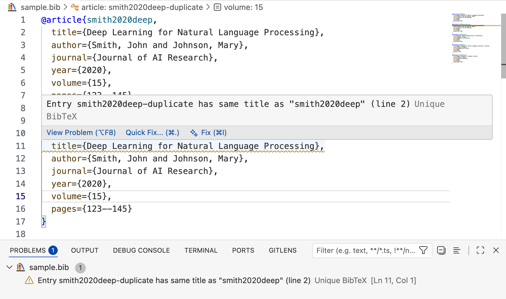

# Unique BibTeX

[English](README.md) | [中文](README.zh-CN.md)

一个 VSCode 扩展，用于检测 BibTeX 文件中的重复和相似条目。

## 功能

- **实时检测**：自动检测完全重复的条目（基于标题）
- **相似度检测**：手动触发，检测相似条目（默认阈值 90%）

## 安装

在 VSCode 扩展商店搜索 "Unique BibTeX"，或从 VSIX 文件安装。

## 使用方法

1. 打开 `.bib` 文件，扩展自动激活
2. 重复条目会以警告形式显示在编辑器中
3. 打开命令面板（macOS 按 `Cmd+Shift+P`，Windows/Linux 按 `Ctrl+Shift+P`），输入 `Unique BibTeX: 检测相似条目` 执行相似度检测

## 效果示例

发现重复时，警告会显示在重复条目上，并指向首次出现的位置：



## 配置

| 设置项 | 默认值 | 说明 |
|--------|--------|------|
| `uniqueBib.similarityThreshold` | `0.9` | 相似度检测阈值 (0.5-1.0) |

在 `settings.json` 中配置：

```json
{
  "uniqueBib.similarityThreshold": 0.85
}
```

## 开发

### 安装依赖

```bash
npm install
```

### 编译

```bash
npm run compile
```

### 调试运行

1. 在 VSCode 中打开项目
2. 按 `F5` 启动调试
3. 在新打开的 Extension Development Host 窗口中打开 `.bib` 文件测试

### 监听模式

```bash
npm run watch
```

### 项目结构

```
src/
├── extension.ts    # 扩展入口
├── bibParser.ts    # BibTeX 解析器
└── similarity.ts   # 相似度计算
```

## 许可证

MIT
